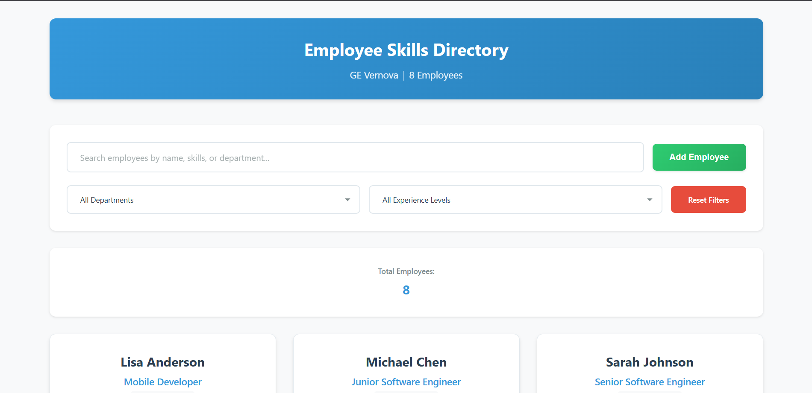
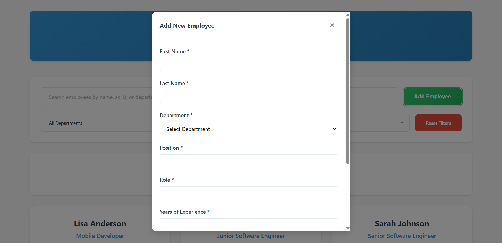

# Employee Skills Directory

An XML-based employee and mentor directory with a searchable, filterable UI using XSLT transformation.

## Project Overview

This project demonstrates how to create an employee directory using:
- XML for data storage
- XSLT for data transformation
- HTML/CSS/JavaScript for user interface and interactivity

## Project Structure

```
EmployeeSkillDirectory/
├── README.md                       Documentation
├── package.json                    Scripts and metadata
├── index.html                      Main entry point
├── data/
│   └── employees.xml               Employee data
├── xslt/
│   ├── employees-to-html.xslt     Main transformation
│   └── employee-card.xslt         Reusable card template
├── css/
│   ├── styles.css                 Main stylesheet
│   ├── cards.css                  Card component styles
│   └── filters.css                Filter styles
└── js/
    ├── app.js                     Main application logic
    ├── employee-manager.js        XML parsing and data access
    ├── filter.js                  Filter functionality
    └── search.js                  Search functionality
```

## Getting Started

### Prerequisites
- A modern web browser (Chrome, Firefox, Edge, Safari)
- A local web server (recommended)

### Running the Project

#### Option 1: npm Scripts (Recommended)
```bash
npm install
npm run start
```

#### Option 2: Direct File Access
Open `index.html` in your web browser.

## Features

- Search employees by name, skills, or department
- Filter by department, role, or experience level
- Responsive design for desktop, tablet, and mobile
- Modular architecture for easy customization
- Simple XML-based data source
- Mentor tracking and availability

## Understanding the Components

### XML Data (data/employees.xml)
Stores employee information including:
- Name
- Position and department
- Years of experience
- Skills with proficiency levels
- Mentor status and specialization

### XSLT Transformation (xslt/)
Converts XML data into HTML:
- `employees-to-html.xslt`: Main transformation
- `employee-card.xslt`: Reusable card template

### Frontend (HTML/CSS/JS)
- `index.html`: Page structure and XSLT loader
- `css/`: Modular stylesheets
- `js/`: JavaScript modules for search, filter, and data access

## UI Screenshot




